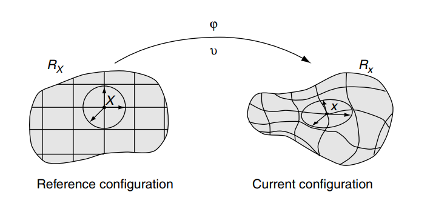

Arbitrary Lagrangian-Eulerian
==================================
 
Arbitrary Lagrangian-Eulerian (ALE)
---------------------------------------------------------------------------
#. `Arbitrary Lagrangian-Eulerian (ALE) and Computational Fluid Dynamics (CFD) <https://2021.help.altair.com/2021/hwsolvers/rad/topics/solvers/rad/arbitrary_lagrangian_eulerian_computational_fluid_dynamics_c.htm>`_
#. `ALE formula <https://max.book118.com/html/2016/1212/71106288.shtm>`_
#. `Arbitrary Lagrangian-Eulerian Methods <https://ww2.lacan.upc.edu/scientificPublications/files/pdfs/2017-ECM-DHPR-blanc.pdf>`_
#. `Arbitrary Lagrangian-Eulerian Methods(Wiley Online Library) <https://onlinelibrary.wiley.com/doi/full/10.1002/0470091355.ecm009>`_
#. `Nonlinear finite elements for continua and structures, Second edition <https://www.wiley.com/en-nz/Nonlinear+Finite+Elements+for+Continua+and+Structures%2C+2nd+Edition-p-9781118632703>`_
#. `image-to-latex <https://github.com/kingyiusuen/image-to-latex/>`_

Eulerian and Lagrangian Descriptions
---------------------------------------------------------------------------
In the mathematics and continuum mechanics literature (cf. Marsden and Hughes, 1983),
different symbols are often used for the same field when it is expressed in terms of different
independent variables, that is, when the description is Eulerian or Lagrangian. In this
convention, the function which in an Eulerian description is :math:`f(\mathbf{x},t)` is denoted by :math:`F(\mathbf{X},t)` in a
Lagrangian description. The two functions are related by

.. math::
  F(\mathbf{X},t)=f(\mathbf{\Phi}(\mathbf{X},t),t) \quad or \quad F=f\circ  \mathbf{\Phi}

Lagrangian and Eulerian viewpoints
---------------------------------------------------------------------------

Two domains are commonly used in continuum mechanics: the material domain :math:`R_{X} \subset \mathbb{R}^{n_{\text {sd }}}`,
with :math:`n_{\text {sd }}` spatial dimensions, made up of material particles :math:`\mathbf{X}`, and the spatial domain :math:`R_{\mathbf{x}}`,
consisting of spatial points :math:`\mathbf{x}`.

.. math::
  \begin{aligned}
    \boldsymbol{\varphi}: R_{\mathbf{X}} \times\left[t_{0}, t_{\text {final }}]\right. & \longrightarrow R_{\mathbf{x}} \times\left[t_{0}, t_{\text {final }}]\right. \\
    (\mathbf{X}, t) & \longmapsto \boldsymbol{\varphi}(\mathbf{X}, t)=(\mathbf{x}, t)
  \end{aligned}
  
which allows us to link :math:`\mathbf{X}` and :math:`\mathbf{x}` in time by the law of motion, namely

.. math::
  \mathbf{x}=\mathbf{x}(\mathbf{X}, t), \quad t=t
  
for two dimensions:

.. math:: 
  \mathbf{x}=\begin{bmatrix}
   x_{1}\\ x_{2}
  \end{bmatrix} \quad or \quad\mathbf{x}=\begin{bmatrix}
   x\\y
  \end{bmatrix} 
  
-

.. math:: 
  \mathbf{X}=\begin{bmatrix}
  X_{1}\\ X_{2}
  \end{bmatrix} \quad or \quad\mathbf{X}=\begin{bmatrix}
  X\\Y
  \end{bmatrix}
  
-

.. math:: 
  \begin{align}
  x_{1}=x_{1}(X_{1},X_{2},t)=\varphi_{1}(X_{1},X_{2},t)\\
  x_{2}=x_{2}(X_{1},X_{2},t)=\varphi_{2}(X_{1},X_{2},t)
  \end{align} 

The matrix

.. math::
  J(u,v)=\cfrac{\partial (x,y)}{\partial (u,v)} =\cfrac{\partial (x(u,v),y(u,v))}{\partial (u,v)}=\begin{bmatrix}
  \cfrac{\partial x(u,v)}{\partial u} & \cfrac{\partial x(u,v)}{\partial v}\\
  \cfrac{\partial y(u,v)}{\partial u}&\cfrac{\partial y(u,v)}{\partial v}
  \end{bmatrix}

-
  
.. math::
  J(u,v)=\cfrac{\partial (x,y)}{\partial (u,v)} =\begin{bmatrix}
  \cfrac{\partial x}{\partial u} & \cfrac{\partial x}{\partial v}\\
  \cfrac{\partial y}{\partial u}&\cfrac{\partial y}{\partial v}
  \end{bmatrix} 
  
-
  
.. math::
  J(X_{1},X_{2})=\cfrac{\partial (x_{1},x_{2})}{\partial (X_{1},X_{2})} =\begin{bmatrix}
  \cfrac{\partial x_{1}}{\partial X_{1}} & \cfrac{\partial x_{1}}{\partial X_{2}}\\
  \cfrac{\partial x_{2}}{\partial X_{1}}&\cfrac{\partial x_{2}}{\partial X_{2}}
  \end{bmatrix} 
  
-
  
.. math::  
  J(X,Y)=\cfrac{\partial (x,y)}{\partial (X,Y)} =\begin{bmatrix}
  \cfrac{\partial x}{\partial X} & \cfrac{\partial x}{\partial Y}\\
  \cfrac{\partial y}{\partial X} & \cfrac{\partial y}{\partial Y}
  \end{bmatrix}
  
-
  
.. math:: 
  J(\mathbf{X})=\cfrac{\partial (\mathbf{x})}{\partial (\mathbf{X})} =
  \cfrac{\partial \mathbf{x}}{\partial \mathbf{X}} =\begin{bmatrix}
  \cfrac{\partial x_{1}}{\partial X_{1}} & \cfrac{\partial x_{1}}{\partial X_{2}}\\
  \cfrac{\partial x_{2}}{\partial X_{1}} & \cfrac{\partial x_{2}}{\partial X_{2}}
  \end{bmatrix} 
  
-
  
.. math:: 
  (\mathbf{x},t)={\stackrel\frown{\mathbf{x}} }=\begin{bmatrix}
  x_{1}\\x_{2}\\t
 \end{bmatrix}
 
-
  
.. math::
  \begin{align}
  x_{1}=x_{1}(X_{1},X_{2},t)=\varphi_{1}(X_{1},X_{2},t)\\
  x_{2}=x_{2}(X_{1},X_{2},t)=\varphi_{2}(X_{1},X_{2},t)\\
  t=\varphi_{3}(X_{1},X_{2},t)\\
  \end{align} 
  
-
  
.. math:: 
  J(X_{1},X_{2},t)=\cfrac{\partial (x_{1},x_{2},t)}{\partial (X_{1},X_{2},t)} =\begin{bmatrix}
  \cfrac{\partial x_{1}}{\partial X_{1}} & \cfrac{\partial x_{1}}{\partial X_{2}}& \cfrac{\partial x_{1}}{\partial t}\\
  \cfrac{\partial x_{2}}{\partial X_{1}} & \cfrac{\partial x_{2}}{\partial X_{2}}& \cfrac{\partial x_{2}}{\partial t}\\
  \cfrac{\partial t}{\partial X_{1}} & \cfrac{\partial t}{\partial X_{2}}& \cfrac{\partial t}{\partial t}\\
  \end{bmatrix} 
  
-
  
.. math:: 
  J(X_{1},X_{2},t)=\cfrac{\partial (x_{1},x_{2},t)}{\partial (X_{1},X_{2},t)} =\begin{bmatrix}
  \cfrac{\partial x_{1}}{\partial X_{1}} & \cfrac{\partial x_{1}}{\partial X_{2}}& v_{1}\\
  \cfrac{\partial x_{2}}{\partial X_{1}} & \cfrac{\partial x_{2}}{\partial X_{2}}& v_{2}\\
  0 & 0 & 1\\
  \end{bmatrix} 
  
which explicitly states the particular nature of :math:`\boldsymbol{\varphi}` : first, the spatial coordinates :math:`\mathbf{x}` depend both
on the material particle, :math:`\mathbf{X}` , and time :math:`t` , and, second, physical time is measured by the same
variable :math:`t` in both material and spatial domains. For every fixed instant :math:`t`, the mapping :math:`\boldsymbol{\varphi}` defines
a configuration in the spatial domain. It is convenient to employ a matrix representation for
the gradient of :math:`\boldsymbol{\varphi}`,

.. math::
  \frac{\partial ({\varphi}_{1},{\varphi}_{2},t)}{\partial(X_{1},X_{2}, t)}=
  \frac{\partial \boldsymbol{\varphi}}{\partial(\mathbf{X}, t)}=\left(\begin{array}{cc}
  \frac{\partial \mathbf{x}}{\partial \mathbf{X}} & \mathbf{v} \\
  \mathbf{0}^{\mathrm{T}} & 1
  \end{array}\right)  
  
where :math:`\mathbf{0}^{\mathrm{T}}` is a null row-vector and the material velocity :math:`\mathbf{v}` is

.. math::
  \mathbf{v}(\mathbf{X}, t)=\left.\frac{\partial \mathbf{x}(\mathbf{X}, t)}{\partial t}\right|_{\mathbf{X}}  
  
-

.. math::  
  \mathbf{v}=\begin{bmatrix}
   v_{1}\\v_{2}
  \end{bmatrix}=
  \begin{bmatrix}
   \cfrac{\partial x_{1}(X_{1},X_{2},t)}{\partial t}\Bigg|_{\mathbf{X}} \\
   \cfrac{\partial x_{2}(X_{1},X_{2},t)}{\partial t}\Bigg|_{\mathbf{X}} 
  \end{bmatrix}  
  
ALE kinematical description
---------------------------------------------------------------------------

